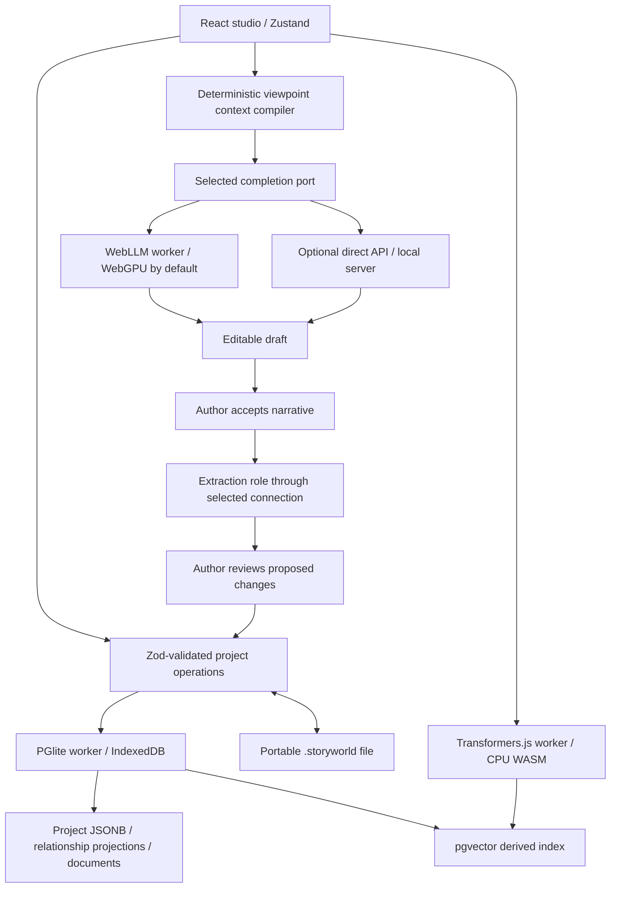

# Architecture

Version 0.9 adds an author-initiated d6 check through the existing mutation/save path. Project format 6 retains validated receipts inside branch/time snapshots, while `.storysystem` format 1 remains unchanged. A pinned review precedes one atomic result/resource update. Receipts have typed non-canon graph edges and stay outside model perception. See [ADR 0006](adr/0006-author-initiated-check-receipts.md).

Version 0.8 adds optional data-only rules over the same medium-agnostic world. Project format 5 preserves installed definitions and branch/time mechanical snapshots through the existing transaction and export path. Direct author saves own mechanical changes; model context and canonical state remain separate. No new backend, dependency, interpreter, or execution graph is introduced. [ADR 0005](adr/0005-optional-declarative-rule-layers.md) records the runtime reconciliation, known graph-projection/subgraph gaps, authority, and limits; the [Product Constitution](PRODUCT_CONSTITUTION.md) defines durable product intent.

Version 0.7 adds opt-in session aggregates and conversation source clips in project format 4. Session clock updates never advance the world revision. The application pauses tracking on background/idle and browser startup, and stores no raw keystrokes. Scenario modes distinguish interview rehearsal from staged scenes and exploration. Interview acceptance skips episodic memory and extraction; the canon validator rejects direct event promotion from interviews. Exact manuscript import validates source text and ancestry, while adaptation runs reuse the existing writer/reviewer graph with a pinned source snapshot and human insertion. See [the workflow guide](PRACTICE.md).

Version 0.6 adds manuscript and voice-evidence graphs at the existing editor, completion, and persistence boundaries. [ADR 0004](adr/0004-manuscript-and-voice-graphs.md) defines specialist contexts, node authority, immutable source evidence, explicit canon approval, and the declared MCW-inspired multi-agent extension. [The manuscript guide](MANUSCRIPT.md) describes the author workflow and current limits.

Storied follows a local-first web-app architecture: static assets, a browser UI, local project storage/search, and browser-local inference by default. Version 0.3 adds optional direct provider connections at the existing completion port; see [ADR 0003](adr/0003-optional-inference-providers.md). A Vite preview server is a development convenience, not an application backend.

Version 0.2 wraps this existing vertical slice in typed execution and world-graph boundaries. [ADR 0001](adr/0001-world-and-execution-graphs.md) specifies current node authority, temporal/epistemic rules, checkpoints, and validated approval. [ADR 0002](adr/0002-mcw-inspired-coordination.md) pins the canonical MCW revision and distinguishes application coordination records from the exploratory framework. The diagram below shows the underlying components, which remain in use.

## Persistence and concurrency

`src/domain/schema.ts` and `workflow-schema.ts` are the versioned domain contracts. A complete project is stored as JSONB; relationships, world graph nodes/edges, workflow checkpoints, and searchable documents are transactionally projected into relational tables. Search embeddings live in a separate table and must match the document’s current source text before retrieval. Restoring a project does not require embeddings.

The database worker serializes operations. The UI batches typing over 300 ms, maintains immutable snapshots, and uses monotonically advancing revisions so an older acknowledgement cannot claim a later edit was saved. Export uses the current in-memory project. Switching, deleting, or applying an application update flushes pending saves first. A failed save remains visible, with retry and export controls.

PGlite 0.5.8 requires an explicit `syncToFs()` after our transaction: the implementation commits before clearing its internal transaction flag. Storied awaits that durability barrier before displaying “Saved on this device.” This is covered by production reload tests.

A Web Lock protects the entire writable library. The MVP opens one editor tab per origin; a second tab gives a clear instruction instead of using stale snapshots to overwrite work. Multiple worlds coexist in the same local database. Importing an already-present project creates a separate copy. No raw SQL or database filesystem archive can be imported.

## Knowledge boundary

The author workspace is intentionally omniscient. The story context is not.

An entity has an in-world description and separate author-only notes/attributes. Only canonical entities visible to the viewpoint are candidates. Public visibility means information plausibly available in this fictional world; the author must mark exceptions private. Private entities/facts/relationships require explicit `knownTo` grants. Mere friendship, a matching search result, or membership in `activeEntityIds` never grants access.

Knowledge claims have their own stance and text. The compiler never dereferences a knowledge claim’s `factId` into a hidden correction. A character can believe the lighthouse failed from neglect without seeing that someone extinguished it deliberately.

Context selects instructions, current input, scenario opening, current character/location/companions, bounded branch history, relevant canonical facts, beliefs, visible relationships, and branch-owned episodic memory. Semantic retrieval returns only eligible entity IDs; the compiler reconstructs safe descriptions from structured state. It never copies raw search snippets. The exact compiled prompt is retained with each accepted turn.

The boundary guarantees exclusion of structured hidden data, not that an LLM cannot independently guess a secret. Authors can intentionally disclose information through scenario openings, instructions, or accepted narrative; those channels are visibly described as model-visible. Prompt instructions alone are not an access control mechanism.

## Adventures and promotion

An adventure snapshots its scenario. Turns form a parent-linked tree. The active head and redo stack are persisted. Undo changes the head; adding after undo creates a sibling branch. Editing a passage creates a new branch instead of rewriting its descendants. Summaries are bounded excerpts of the current branch, and episodic memories are constrained by adventure, viewpoint, and ancestry.

Narrative acceptance records prose and memory only. Extraction is optional and runs with a distinct local model role. WebLLM constrains its JSON output to a proposal schema with short handles for visible active entities; the app validates those handles and maps them back to existing IDs. A failed extraction adds no proposals. Schema-conforming prose can still be inaccurate and always requires human review. Reviewed events, facts, relationships, and knowledge are committed by explicit operations with narrative provenance. Conflicting facts coexist and are labeled “Possible contradiction”; there is no automatic retcon.

## UI and runtimes

React, TypeScript, Vite, Zustand, Tailwind, lucide-react, and local shadcn-style Button/Dialog primitives form the UI. Dialogs use Radix focus management and labeling. No UI operation needs AI to save creative work. Text, not HTML, is the manuscript representation; reading mode supports paragraphs, `##` headings, bold, italic, and entity mentions.

PGlite, WebLLM, and Transformers.js each run in separate dedicated workers. Model roles are distinct interfaces even when the same generative model supplies storyteller, worldbuilder, summarizer, and extractor. The current summary implementation is deterministic excerpting rather than generative compression.

Upstream references: [PGlite API](https://pglite.dev/docs/api), [WebLLM worker architecture](https://webllm.mlc.ai/docs/user/advanced_usage.html), [Transformers.js environment](https://huggingface.co/docs/transformers.js/v3.8.1/api/env).
