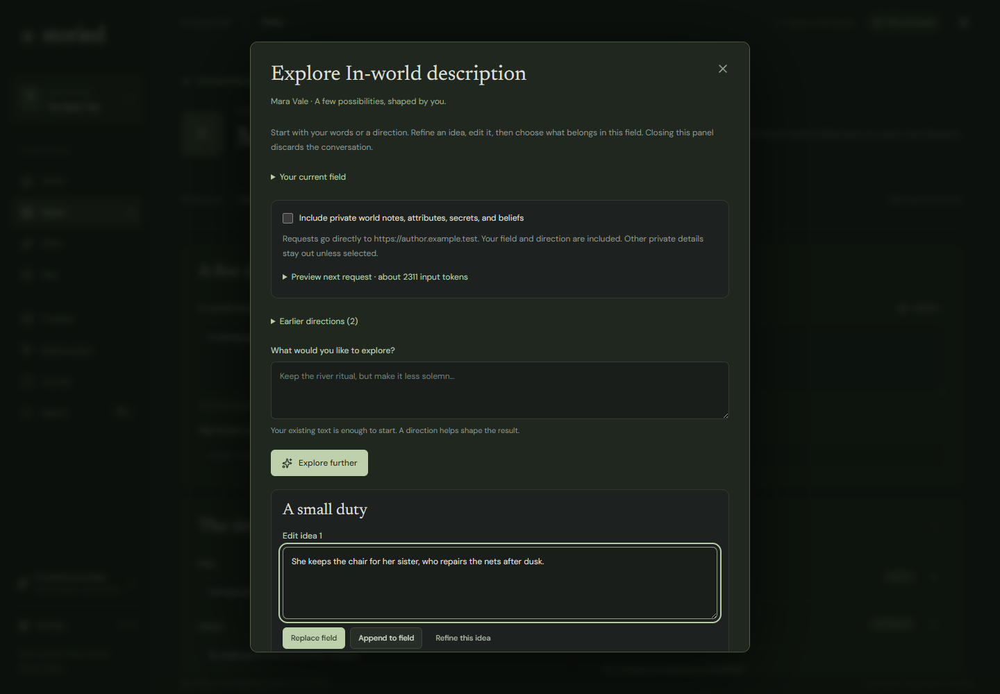

# Explore a field

Version 0.5 adds **Explore** beside fields in the story bible. It is an optional brainstorming panel, using the same selected on-device or API storyteller as Play. Opening the panel sends no request.

## From a starting point to a chosen detail

Write a few words in the field, or open Explore and describe what you need in **What would you like to explore?**. A blank field with no direction cannot generate. Select **Find possibilities** to request one or two alternatives. The field remains unchanged.

Each idea is editable. **Refine this idea** selects a starting point for the next direction; **Explore further** uses that direction and a bounded recent conversation. Choose **Use in field**, **Replace field**, or **Append to field** when you are ready. **Undo** beside the field restores the exact prior text if the field has not subsequently changed. You can also close the panel without inserting anything.

Supported fields are a new element's name and description, an existing element's in-world description, every custom attribute, private author notes, and the value/description in new fact, relationship, and belief forms. This applies to all 11 element types, including Religion, Culture, and System. It does not bulk-generate a complete profile or edit a selected span inside a manuscript.

In new-element and new-detail forms, insertion fills the form; **Add to world** or **Save detail** remains a separate author action. Existing fields autosave after insertion, as they do after typing. An in-world description can enter later storyteller context; private notes and attributes remain author reference. No fact, relationship, knowledge grant, or canon-status change is automatically inferred from an insertion.

## World context and privacy

The author-context compiler is separate from Play's character-view compiler. It includes the current field, direction, project-level writing instructions, a bounded conversation, and relevant canonical story-bible records. It prioritizes the subject and connected entities. Public entity descriptions, public canonical facts/relationships, and applicable timeline records are eligible. Dates and belief labels remain explicit. This is an author view across the bible's timeline, not a simulation of what a character knows at one moment.

Private entities, secrets, author notes, attributes, and subjective accounts require **Include private world notes, attributes, secrets, and beliefs**. The selected field and your explicit direction are always sent, even if you are working in a private field. Changing the private-context choice clears ideas and history to prevent a previously private conversation being reused accidentally.

Branch-specific records, manuscript text, player memories, journal entries, images, provider settings, and credentials are not collected by this compiler. Character beliefs do not become objective facts. Non-canonical world records are excluded, except for the field you explicitly selected as a working draft. No search document or raw project JSON is sent.

The source context is bounded to 10,500 characters; some descriptions are labeled excerpts, and the panel reports records omitted for space. **Preview next request** shows the prose system instructions and source prompt. **Last request** preserves the exact compiled source prompt, system instructions, model label, and destination for the most recent call. The transport adds the displayed operation's JSON response schema where required. This is not a claim that the model sees or fully understands the entire world.

Conversations and uninserted ideas live only in panel memory and disappear on close/reload. Inserted text uses normal local project persistence and exports. Remote providers receive explicitly requested context and apply their own retention policies. There is no automatic fallback, background generation, or paid-request retry. Stop/close cancels the owned request and ignores late results; stopping on-device inference unloads its runtime as in Play. A changed field or world revision blocks stale insertion and asks you to reopen with fresh context.

## Prose preferences

All generation transports now share `src/domain/writing-style.ts`, including the on-device worker, API connections, storytelling, extraction, and field assistance. The policy follows the author's requested direction using [Signs of AI writing](https://en.wikipedia.org/wiki/Wikipedia:Signs_of_AI_writing) as an editorial reference. The article is not a deterministic specification for fiction or a reliable authorship classifier.

Prompts request specific prose in the author's voice and a silent revision before output. Limited local editorial hints flag some recognizable wording, punctuation, and formatting patterns in suggestion text and AI story drafts. These hints do not classify authorship, automatically rewrite text, block an author's deliberate choice, or certify that a model has obeyed every instruction. JSON validation checks structure and field length, not literary quality or fictional truth. Human review is still necessary, especially for small local models.

