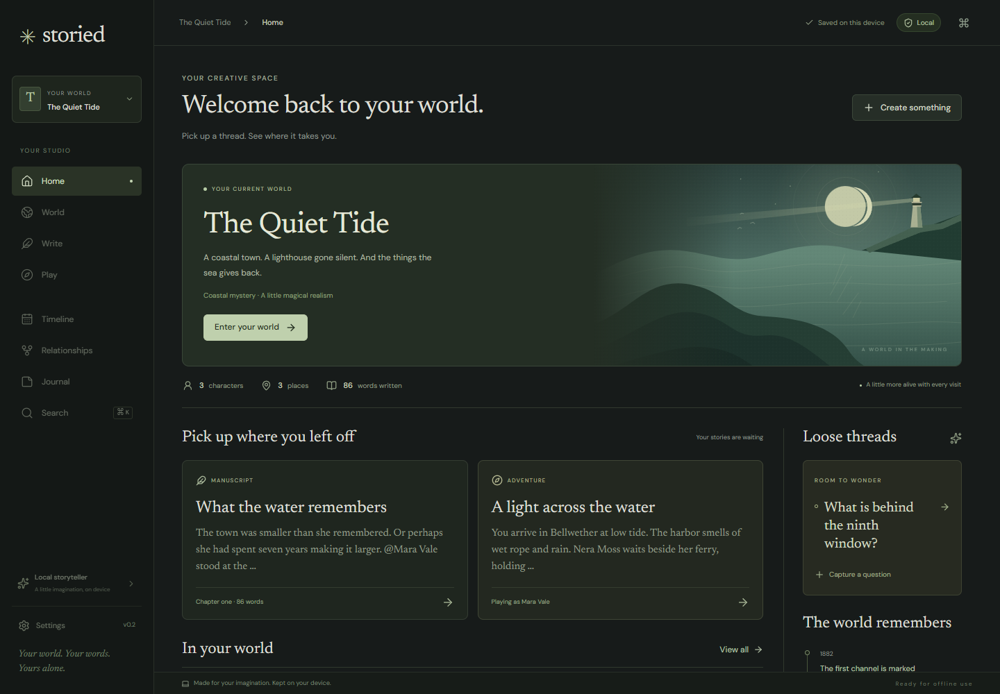
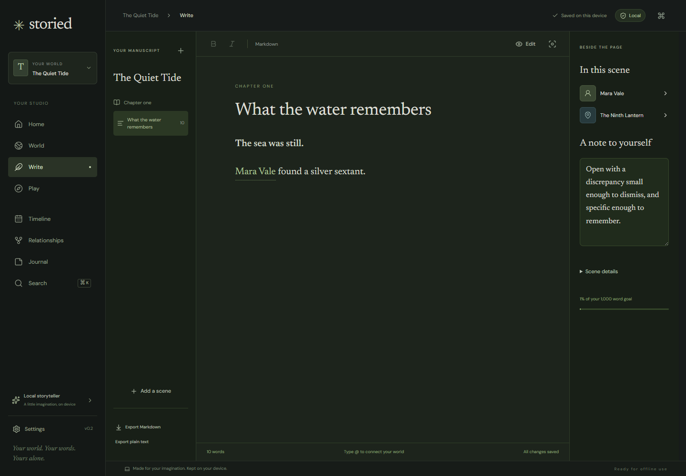
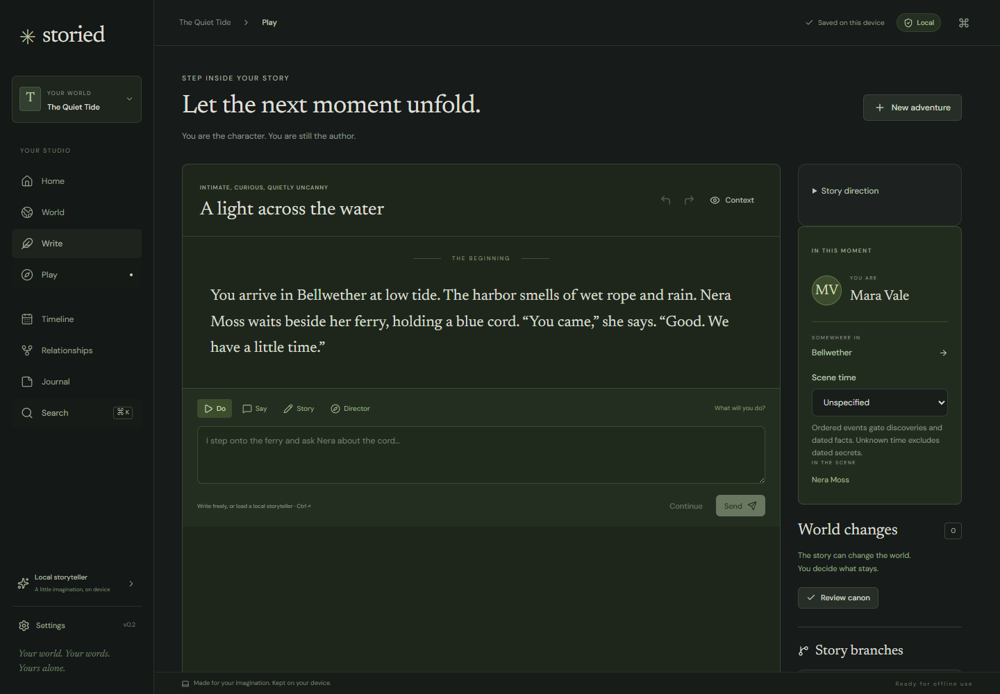
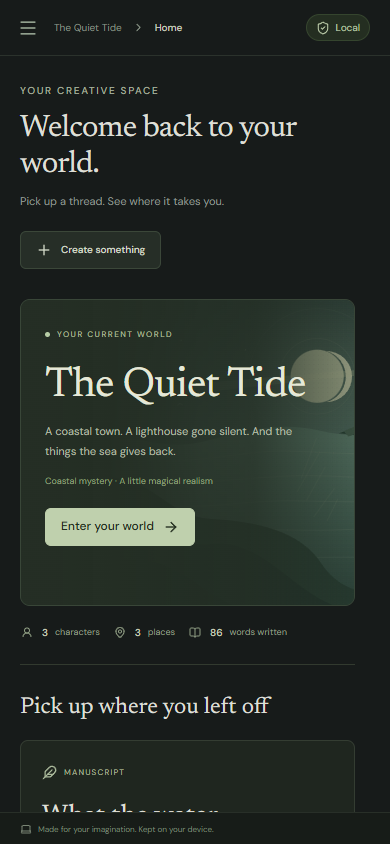

# Verification and MVP limits

## Version 0.1 public deployment verification

The production site at **https://storied.alecakin.com** was verified on 2026-09-05 (America/Denver). **47 unit tests**, TypeScript, production build, and formatting passed. All **5 browser workflows passed against the public origin** in 58.1 seconds, including real cached Qwen/MiniLM inference, retry, extraction, semantic search, and project restore while the browser network was disabled. The hardware workflow took 35.2 seconds. These timings describe this device and run only.

All **56 deployed assets** matched the built files byte for byte. HTTPS, restrictive CSP, and removal of browser error-reporting headers were verified. The fresh in-app browser showed offline readiness and no console warnings/errors. Cloudflare confirms a static-assets service without an application module, bindings, or remote database. A model-manager operation queue fixes the cache-status/load race discovered during production testing; four regression tests cover ordering, cancellation, recovery, and progress messages.

Evidence: [deployment asset hashes](verification/deployment-assets.json), [production model observations](verification/production-model-evidence.json), and [restored production test project](verification/production-offline-model-world.storyworld). The model observations contain original demo material and generated test fiction. As in the initial run below, the accepted passage was explicitly human-edited before canon review. Screenshots below were refreshed by the production browser suite. The public source ZIP preserves the source and documentation snapshot used to build this deployment; this verification record was added afterward.

## Initial local verification

Verified on 2026-09-05 (America/Denver), Windows, Microsoft Edge **152.0.4191.62**, against the production build at `http://127.0.0.1:4173`. Browser tests use isolated temporary contexts and original demo/test fiction. No model response is mocked.

## Results

| Check                                                                       | Result                                               |
| --------------------------------------------------------------------------- | ---------------------------------------------------- |
| TypeScript (`npm run check`)                                                | Passed                                               |
| Domain, privacy, extraction, and real PGlite/pgvector tests (`npm test`)    | **43 passed**                                        |
| Production build (`npm run build`)                                          | Passed; static PWA and bundled WASM produced         |
| Browser suite with real model opt-in                                        | **5 passed**, about one minute on this device        |
| Production dependency audit (`npm audit --omit=dev --audit-level=moderate`) | **0 vulnerabilities reported** at verification time  |
| Desktop and narrow-screen visual inspection                                 | Reviewed at 1440×1000 and 390×844; screenshots below |

The build reports upstream PGlite `eval` warnings. The production CSP still forbids JavaScript `unsafe-eval`; the tested database/worker paths run successfully with that policy. WASM compilation is separately allowed. An npm audit result is not a comprehensive security audit.

## Complete workflows exercised

The ordinary browser suite creates a world, character, location, relationship, and private royal secret; creates an adventure; inspects context; authors and accepts a passage; promotes a proposed event; undoes/redoes the story; reloads offline; exports, deletes, and restores the complete project while offline. It also exercises manuscript formatting and inline entity inspection, exact search, the single-editor lock, malformed imports, narrow-screen navigation, and keyboard commands. Routine application work produced no external requests and no uncaught page errors.

The explicit hardware test downloads the fixed Qwen 2.5 **0.5B q4f32** model and **MiniLM L6 q8** through the app’s model controls. It then calls `context.setOffline(true)` **before reloading the application**. Both models are loaded again from their device caches with the download gate closed. Still offline, the test:

1. Checks that the inspected context excludes the demo secret.
2. Generates a passage using WebGPU, retries, and receives different generated text.
3. Edits the draft into a clear event and accepts it.
4. Receives two genuine model-generated change proposals using constrained JSON extraction.
5. Reviews and edits one proposal, explicitly accepts it into canon, and finds it in the timeline.
6. Uses MiniLM/pgvector meaning search for a paraphrase about a ferryperson, then retrieves the new episodic memory.
7. Exports `.storyworld`, deletes the project, imports the file, and verifies restored accepted narrative.

There were **31 external GET asset requests during the explicit downloads**, with no request bodies, and **zero external requests during the offline work**. No uncaught page errors occurred. The hardware workflow completed in **46.8 seconds** on this device; this is an observation, not a performance guarantee.

Exact generated drafts and run observations are preserved in [live-model-evidence.json](verification/live-model-evidence.json). The complete restored test world is [offline-model-world.storyworld](verification/offline-model-world.storyworld). Both contain only original demo material and locally generated test fiction. The accepted passage was deliberately human-edited; it must not be represented as unedited model output.

The small model’s drafts contained perspective drift, repetition, and invented details. Its extracted proposals also required review/editing. The evidence demonstrates working local computation and reversible authorship, not high-quality prose or factual extraction. Structured hidden information is excluded by the compiler; no probabilistic model can be guaranteed never to guess a secret independently.

## Automated correctness coverage

- Multiple adversarial secret cases: hidden death, private entity names, relationship visibility, hidden corrections behind false beliefs, private author notes, and semantic candidates attempting to bypass visibility.
- Canon-only selection, explicit knowledge grants, deterministic bounded context, and no sibling/adventure/viewpoint memory leakage.
- Scenario snapshot isolation, parent-linked branching, undo/redo, editing into a branch, and explicit canon promotion with provenance.
- Known-format migration, complete archive round-trip, images/pins/templates, duplicate/dangling identifiers, invalid branches, future schemas, unsupported executable/remote fields, and oversize archives.
- PGlite transaction rollback, idempotent migration, relational backlinks, project deletion cascades, actual pgvector queries, pre-limit eligibility filtering, tag/type filters, and stale-vector exclusion.
- Network gate closed outside downloads; approved asset-only GET/HEAD, omitted credentials/referrers, no request body, and unapproved host rejection.
- Extraction schema/handle validation, private entity exclusion, malformed JSON rejection, and no implicit world mutation.

Reload tests exposed a PGlite transaction durability issue during development. The worker now explicitly awaits `syncToFs()` before acknowledging saves; production persistence and restore tests pass with the fix.

## Reproduce

```powershell
npm ci
npm run check
npm test
npm run build
$env:PW_CHANNEL = 'msedge'
npm run test:e2e
```

The normal suite skips the hardware test. To explicitly authorize its approximately 400 MB + 23 MB model downloads and exercise real inference:

```powershell
$env:LIVE_MODELS = '1'
$env:PW_CHANNEL = 'msedge'
npm run test:e2e -- tests/e2e/local-models.spec.ts
```

Use a compatible WebGPU device with enough free graphics memory. Chromium can be installed with `npx playwright install chromium` and used without `PW_CHANNEL`. The larger Qwen **1.5B** catalog entry has not been exercised on this run. Safari/Firefox/mobile hardware inference and OS-level PWA installation have not been verified. The PWA manifest, service-worker cache, and offline browser behavior have been verified. Public deployment was verified separately as recorded above.

## Deliberate MVP limits

- **32 MiB per portable project**, including embedded images; oversize edits are rejected before altering the saved world. One editor tab per origin; no simultaneous collaboration or cross-device synchronization.
- The manuscript is plain Markdown with a focused formatting subset. Books and chapters organize scenes; advanced rich text, pagination, DOCX, EPUB, and PDF export are future work.
- Story summaries are bounded deterministic excerpts, not sophisticated long-history compression. All accepted turns remain stored and searchable, but only a bounded selection enters a prompt.
- Semantic search embeds the first 2,400 characters of each document, with additional transformer input truncation possible. It currently rebuilds the project’s embeddings when requested. Long-document chunking and incremental indexing remain follow-ups.
- Automatic extraction supports facts, events, relationships, and knowledge about visible active entities. New entities are explicitly created in World. No automatic retcon or broad manuscript contradiction analysis; the current checks cover conflicting fact values and reversed birth/death years.
- The relationship graph shows the first 18 entities; the complete relationship list remains available. World dates support free text and approximate dates, with natural text ordering rather than a custom calendar engine.
- Local raster image/map attachment is available. Map pins survive native import/export; an interactive pin-placement/cartography editor is not included.
- Browser storage persistence is a request to the browser, not an independent backup. Keep native exports. Version 0.2 preserves unaccepted drafts and exact boundary records in local workflow checkpoints and native exports; accepting a passage adds it to adventure history.

## Visual evidence








