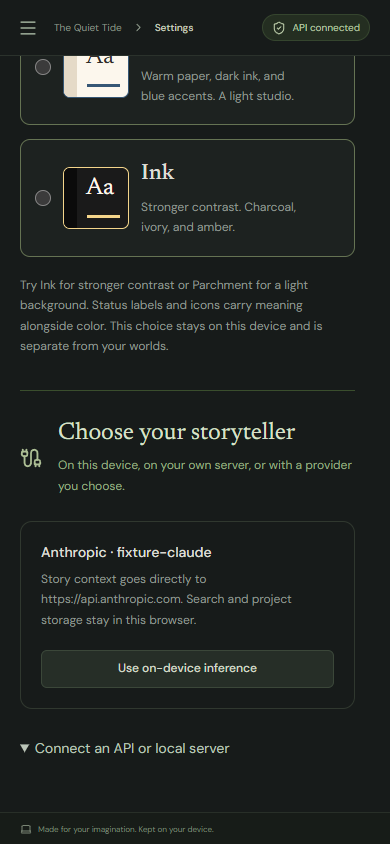

# Verification and MVP limits

## Version 0.9 reusable rules and checks

This release adds the standalone Lantern crossing ruleset and one author-initiated d6-plus-attribute check with reviewed stakes, an optional attempt cost, and fixed branch history. [The report](V0.9_REPORT.md), [guide](RULES.md), and [ADR 0006](adr/0006-author-initiated-check-receipts.md) define its boundaries. Format 5 migrates additively to 6, preserving existing installed/active rules and state. Model perception and canon authority remain unchanged.

**158 unit tests across 12 files pass.** TypeScript and the production build pass; the existing upstream PGlite eval warnings remain. All **six focused rules/check browser workflows pass** in 1.0 minute: [focused browser results](verification/v0.9-checks-local.json). They exercise review cancellation, cost preview and application, fixed results across offline reload/import, offline ruleset download, independent reuse in two worlds, branch copies, corrupted-receipt rejection, and unavailable installations. [Desktop review](screenshots/check-review.png) and [mobile history](screenshots/check-history-mobile.png) were visually inspected.

All **35 ordinary local browser workflows pass** in 4.6 minutes: [full local results](verification/v0.9-local-browser-tests.json). The optional hardware/model-download workflow is skipped.

Deployed at **https://storied.alecakin.com**, Worker version `cb22bbfd-591a-4427-a6fa-b6af5b911083`, rollout `afbf8bf3-58e0-4935-9f77-4e38d4eaea7a` at 100%. All **58 assets (52,923,295 bytes)** match the tested release, including the new ruleset and 5,240,969-byte source archive: [asset hashes and headers](verification/v0.9-deployment-assets.json), [hosting receipt](verification/v0.9-hosting.json). Deployment used the existing Cloudflare [direct asset upload flow](https://developers.cloudflare.com/workers/static-assets/direct-upload/). Hosting remains assets-only with empty bindings, disabled observability/workers.dev/previews, and no browser error-reporting headers.

An isolated browser completed the **live service-worker update from v0.8 to v0.9**, preserving project identity, all 18 deeply compared collections, existing manuscript and accepted passage, active rules, and branch state through format 5 → 6. Offline reload retained both writing and mechanical values; no checks were created automatically. [Live upgrade evidence](verification/v0.9-in-place-upgrade.json). The preparation helper's initial Settings selector incorrectly assumed Settings was inside the main navigation group; it was corrected before deployment. Record comparison uses structural equality, avoiding the prior release's JSON key-order issue.

All **35 ordinary public browser workflows passed** in 5.4 minutes: [production results](verification/v0.9-production-browser-tests.json). The optional hardware/model-download workflow was skipped. Screenshots were refreshed from this run. Formatting and diff whitespace checks pass. [The changed-file manifest](verification/v0.9-changed-files.json) enumerates application, test, documentation, screenshot, and verification changes.

The corresponding source ZIP is the packaging-time snapshot; subsequent live receipts remain in the workspace. No paid-provider or new real-model quality result is claimed.

## Version 0.8 optional rule layers

This release adds an explicit import, enable, activate, and author-edit flow for bounded declarative rules over existing entities. [The implementation report](V0.8_REPORT.md), [guide](RULES.md), and [ADR 0005](adr/0005-optional-declarative-rule-layers.md) define the scope. Format 4 migrates additively to 5 with rules off. Mechanical state remains separate from prose, canon, and character knowledge; the model cannot see or change it in this slice.

**147 unit tests across 11 files pass**, including malformed rules, one-hop dependency validation, numeric bounds, explicit activation, branch/time isolation, stale saves, removal and exact reinstallation, missing-system import validation, typed projections, and unchanged model context. `npm run check` and the production build pass; the build retains the existing upstream PGlite eval warnings.

All **32 ordinary local browser workflows pass** in 2.7 minutes: [full local results](verification/v0.8-local-browser-tests.json). The optional hardware/model-download workflow is skipped. All three new rules workflows pass independently in 18.4 seconds: [focused results](verification/v0.8-rules-final-local.json). The [initial focused run](verification/v0.8-rules-local.json) retains one failure caused by navigating before asynchronous project import completed; adding an import-completion wait fixed the test. The browser checks cover save/reload, offline export/import, opt-in activation, independent branch copies, narrative preservation after removal, invalid-file rejection, unavailable installations, and mobile layout. The [mobile rules screenshot](screenshots/rules-mobile.png) was visually inspected.

Deployed at **https://storied.alecakin.com**, Worker version `53c82abe-a659-4d26-9726-23b56371a16c`, rollout `ccc7b410-9877-456f-8553-e970696b9ec9` at 100%. All **57 assets (52,675,923 bytes)** match the release build, including its source ZIP: [asset hashes and headers](verification/v0.8-deployment-assets.json), [hosting receipt](verification/v0.8-hosting.json). Hosting remains assets-only, with no application bindings or observability and without browser error-reporting headers. Deployment used Cloudflare's [direct asset upload flow](https://developers.cloudflare.com/workers/static-assets/direct-upload/), preserving the existing custom domain and disabled workers.dev/previews.

The isolated live update reached v0.8.0 and displayed the prior accepted passage, but its raw JSON comparison stopped at entity records. A local service-worker replay from committed v0.7 (`c582b94`) to the deployed v0.8 build reproduced the cause: custom-field keys changed from `Role, Pronouns, Desire` to `Role, Desire, Pronouns` during database persistence. Entity contents were deeply equal. The corrected comparison preserved all 16 tested record collections, manuscript studio, project identity, and offline reopening, with rules empty and off: [upgrade evidence and key-order diagnosis](verification/v0.8-in-place-upgrade.json). This replay is local evidence, not a completed live-origin record comparison.

All **32 ordinary public browser workflows passed** in 3.6 minutes: [production results](verification/v0.8-production-browser-tests.json). The optional hardware/model-download workflow was skipped. Screenshots were refreshed from this run. TypeScript, production build, formatting, and diff whitespace checks pass. The [changed-file manifest](verification/v0.8-changed-files.json) includes source, documentation, screenshots, and receipts.

The source ZIP is the packaging-time snapshot; subsequent live receipts and screenshots remain in the workspace. No new real-model or paid-provider quality result is claimed.

## Version 0.7 practice and conversation sources

Deployed at **https://storied.alecakin.com**, Worker version `800d0a8b-7017-421e-9b7a-d05dc34739a5`, rollout `50b28779-3fe4-44bb-9269-f8b9f61a1d92` at 100%. All **57 assets (52,548,264 bytes)** match the tested release, including the source ZIP: [asset hashes and headers](verification/v0.7-deployment-assets.json), [hosting receipt](verification/v0.7-hosting.json). Hosting remains assets-only, with no application bindings or observability, and without browser error-reporting headers.

All **29 ordinary browser workflows passed on the public origin** in 3.0 minutes: [production results](verification/v0.7-production-browser-tests.json). The optional hardware/model-download workflow was skipped. [Progress](screenshots/practice-progress.png) and [mobile conversation selection](screenshots/conversation-mobile.png) screenshots were refreshed from this run.

This release adds optional local practice sessions and daily history, character interviews, staged scenes, and exact or adapted conversation excerpts for manuscripts. The [practice guide](PRACTICE.md) describes timing, word accounting, source attribution, and canon boundaries. Existing projects migrate from format 3 to 4 with tracking disabled and empty clip history; earlier migrations remain supported.

The domain suite passes **137 tests** across ten files. New coverage exercises zero-baseline goals, separate assisted/imported counts, deletions and revisions, one unfinished session, midnight splitting and suspended-clock limits, migration/export, exact source ranges and branches, interview knowledge filtering, and the prohibition on interview memory/extraction/canon promotion. Clock changes do not invalidate manuscript runs.

Four new browser workflows exercise session pause/resume and persistence, idle/thinking policy, disabling and clearing tracking, mobile exact imports, and partial dialogue adaptation through separate writer/continuity/prose contexts with explicit author insertion. The adaptation provider is synthetic. Partial text selection uses the browser's native selection range API and the real Keep button; this does not establish keyboard or touch-selection parity across browsers. The model runtimes are unchanged and the optional hardware test is not part of this release's ordinary regression run; earlier real-model observations and limits remain below.

All **29 ordinary local browser workflows passed** in 2.1 minutes: [local browser results](verification/v0.7-local-browser-tests.json). TypeScript, the production build, formatting, and diff whitespace checks pass. The build retains the existing upstream PGlite eval warnings. The source ZIP is the packaging-time snapshot; later live receipts and screenshots are retained in the workspace.

An isolated browser accepted the live service-worker update and displayed v0.7.0 with the existing project. Its helper stopped at an outdated exact badge selector (`v0.7`), before comparing exported records. A corrected local service-worker replay used the committed v0.6 source (`3161a85`) and the deployed v0.7 build. It preserved project identity, manuscript text, all tested creative collections and studio records, then reopened the manuscript offline: [upgrade comparison](verification/v0.7-in-place-upgrade.json). The local replay is not an additional live-origin deployment test.

## Version 0.6 manuscripts and author voice

Deployed at **https://storied.alecakin.com**, Worker version `cce70c66-52b7-42c7-9467-78b5d3d6baee`, rollout `be34f94d-0f52-416c-894d-c666dcd250ae` at 100%. All **57 assets (52,156,964 bytes)** match the release build, including the source archive: [asset hashes and headers](verification/v0.6-deployment-assets.json), [hosting receipt](verification/v0.6-hosting.json). The service remains assets-only, without application bindings or observability. Browser error-reporting headers remain absent.

The served source archive is the packaging-time source/docs snapshot. Post-deployment verification records and screenshots were added afterward; the deployed application code and assets were not rebuilt during live verification.

All **25 ordinary browser workflows were verified on the public origin**. The [initial public run](verification/v0.6-production-browser-tests.json) completed 24 and stopped the theme workflow on a local Windows screenshot-write error (`UNKNOWN`, opening `theme-midnight-relationships.png`), rather than an application assertion. The unchanged [theme recheck](verification/v0.6-production-theme-recheck.json) passed in 10.5 seconds, including contrast checks, keyboard selection, and offline persistence. [Public contrast observations](verification/v0.6-production-theme-contrast.json) retain the measurements. The real-model workflow was run locally as documented below and skipped in the ordinary public run.

The release adds scene setup and ordering, selection/cursor assistance, separate writer/continuity/prose/voice/analysis roles, exact-span review highlights, explicit canon preview and approval, manuscript revisions, and evidence-backed voice profiles. Format-1 and format-2 migrations preserve prior writing and world records. [The guide](MANUSCRIPT.md) and [ADR 0004](adr/0004-manuscript-and-voice-graphs.md) define scope, authority, and the MCW-inspired multi-agent extension.

The domain suite passes **127 tests** across nine files. New coverage checks visibility, branch/time gating, attributed beliefs, separate reviewer contexts, approved voice evidence, exact quote occurrences, invalid/cyclic imports, immutable evidence links, context/output bounds, changed-source invalidation, human-only insertion, canon corrections, and temporal changes.

Six new isolated browser workflows cover samples from unrelated topics, profile approval, all specialist roles, edited insertion and restoration, source-linked canon changes, offline export/import, mobile annotations, malformed evidence, explicit retry, cancellation/reload without replay, and late-response protection. Provider responses in these six tests are synthetic. No live paid cloud-provider quality claim is made.

The full local regression suite passed **25 ordinary browser workflows** in 2.6 minutes: [local results](verification/v0.6-local-browser-tests.json). After the compact-contract and interface refinements, the six new browser workflows plus the real offline model workflow passed together: [final focused results](verification/v0.6-final-focused-tests.json). TypeScript, production build, formatting, and diff whitespace checks pass.

The compact local run produced valid review JSON but cited text absent from the candidate. Evidence validation correctly paused that pass and applied no findings. Its manuscript draft was accepted offline, and the workflow again recorded zero offline requests and zero page errors. [Compact model evidence](verification/v0.6-compact-local-model-evidence.json) and [exported project](verification/v0.6-compact-local-model-world.storyworld) preserve the result. This is a concrete limitation of the tested 0.5B model, not a passing semantic-quality evaluation.

The initial real Qwen 0.5B/MiniLM run passed the full offline workflow, including manuscript generation and author acceptance, in 2.5 minutes. It recorded **zero requests during offline work and zero uncaught page errors**. Its continuity reviewer ran past the output budget and produced invalid JSON, which was retained with a visible pause; no review or canon change was accepted. [Initial model evidence](verification/v0.6-local-model-evidence.json), [hardware report](verification/v0.6-local-hardware-tests.json), and [exported project](verification/v0.6-local-model-world.storyworld) retain that outcome. This prompted a compact on-device response contract; successful generation is not evidence of reliable semantic review by the smallest model.

Review annotations are an explicit review view, not continuously remapped live spellchecking. Samples support TXT/Markdown and paste, not DOCX/PDF extraction. Specialists share the selected model with separate contexts; per-role model routing is future work. Evidence validation establishes span/source identity, not semantic truth, complete canon consistency, author-voice fidelity, or MCW effectiveness.

## Version 0.5.1 creation and scrolling fixes

Deployed at **https://storied.alecakin.com**, deployment `b47e64b1d6cc4e45ad2ec5df7a85d7ef`. All **57 assets (51,564,215 bytes)** match the release build, including the source archive. Static-only hosting and existing privacy/security headers are verified in the [asset report](verification/v0.5.1-deployment-assets.json).

All **19 ordinary browser workflows passed against the public origin** in 2.1 minutes, including the new creation/scroll regressions, offline restore, field assistance, provider fixtures, and themes. The hardware/model-download test was intentionally skipped. [Production results](verification/v0.5.1-production-browser-tests.json) record the run.

The World creation dialog now inherits the selected entity type through both the header and empty-result actions. Everything retains Character as its default. A positioned workspace boundary contains hidden file controls that previously enlarged the outer document; scroll gestures stay within the workspace.

Before the fix, the focused browser regressions reproduced Concept opening as Character and Settings extending the document to 1,765 pixels in a 900-pixel viewport and 2,625 pixels in a 660-pixel viewport. All three focused checks now pass: [local results](verification/v0.5.1-local-layout-tests.json). They cover six type filters, both creation buttons, actual Concept creation, desktop/mobile document bounds, scrolling to content ends, dialogs, and writing focus mode. An initial post-fix test scrolled the manuscript textarea instead of its enclosing workspace; the test now directs the gesture to the workspace edge.

The production build (including TypeScript) and formatting checks pass. This patch changes UI creation context and CSS only; model runtimes were not rerun. The source archive is the packaging-time source/docs snapshot; subsequent live verification records remain in the workspace.

## Version 0.5 field assistance

Deployed at **https://storied.alecakin.com**, deployment `018379eb59a24c6cb54f486f2769c2d9`. All **57 assets (51,515,393 bytes)** match the release build, including the source ZIP; static-only hosting and privacy/security headers remain active. [Asset verification](verification/v0.5-deployment-assets.json) was completed before the public browser run.

All **16 ordinary production browser workflows passed**. The first real-model workflow failed because Qwen 0.5B returned a field suggestion that failed validation; the UI left the author's field unchanged and offered an explicit retry. [The initial production report](verification/v0.5-production-browser-tests.json) retains that failure. A subsequent fresh hardware run completed generation, retry, extraction, semantic search, field assistance, human-edited insertion, and restore offline in 39.8 seconds: [hardware report](verification/v0.5-production-hardware-recovery.json), [model evidence](verification/v0.5-production-model-evidence.json), and [exported world](verification/v0.5-production-offline-model-world.storyworld). That run needed no field-request retry and recorded zero requests during offline work and zero uncaught page errors. These outcomes show that the smallest model can occasionally fail the response contract; they are not evidence of perfect model reliability. The browser test now detects validation errors promptly and permits one explicit author-directed recovery attempt, recording it if used.

Theme regression checks also passed: [production contrast observations](verification/v0.5-production-theme-contrast.json). Screenshots were refreshed from production. The published source ZIP is the packaging-time source/test/docs snapshot; later verification records and the hardware test's recovery instrumentation remain in the workspace.

TypeScript, production build, and **106 unit tests** pass. Three focused browser workflows pass locally, covering world context and private opt-in, refinement, author editing, insertion/undo, blank-field direction, new Religion creation, custom attributes, mobile persistence, malformed replies, cancellation, and no automatic retries. Replies in those API tests are fixtures, not live paid-provider validation.

The [field assistance guide](AUTHORING.md) describes scope, context limits, transient conversations, canon authority, and the shared prose policy. Editorial hints and prompts do not establish literary quality, factual consistency, or perfect compliance with style preferences. The field helper does not grant characters knowledge or execute model-proposed world mutations.

The local suite exercised **all 17 workflows**. Its first full run had 16 passes and one ambiguous test selector: the new Explore button also matched the old partial label query for the creation description. After making that query exact, the entire create/connect/secret/author/commit/export/offline-restore case passed separately in 9.6 seconds. [Initial local browser results](verification/v0.5-local-browser-tests.json) retain that failure rather than hiding it.

The hardware case passed with real Qwen 2.5 0.5B and MiniLM: generation, retry, extraction, semantic search, field suggestions, human-edited insertion, and restore all ran with networking disabled. It recorded **zero requests during offline work and zero uncaught page errors**. [Model observations](verification/v0.5-local-model-evidence.json) and the [complete exported test world](verification/v0.5-offline-model-world.storyworld) preserve the evidence. The generated prose includes style violations despite the policy; the example inserted into the world was human-edited. This demonstrates the feature's operation and its model-quality limits, not a guarantee of prose quality.

## Version 0.4 appearance and roadmap

Deployed at **https://storied.alecakin.com**, deployment `116d5332b11b43dd84963b378e4ba0a4`. All **57 assets (51,258,132 bytes)** match the built files, and the privacy/security headers remain active: [asset report](verification/v0.4-deployment-assets.json). After deployment propagation settled, the complete ordinary browser suite passed against the public origin: **13 passed, zero failures, one opt-in hardware test skipped**, in approximately 1.5 minutes. [Browser results](verification/v0.4-browser-tests.json) record the run. The unchanged on-device runtimes were last verified with real offline models in v0.3. The source ZIP contains the packaging-time source/docs; subsequent deployment verification records remain in the workspace.

Production build, TypeScript, and **98 unit tests** pass. A browser workflow exercises all four palettes, the settings radio controls, keyboard selection, a 390-pixel viewport, theme-color metadata, and offline preference persistence. The alternate themes are measured across Settings, Home, World, Write, Play, and Relationships using actual computed foreground/background colors. [Local contrast observations](verification/v0.4-local-theme-contrast.json) preserve the measurements. Transitions finish before measurement so intermediate cross-theme colors are not confused with the final palette.

The [production measurements](verification/v0.4-production-theme-contrast.json) cover **264 text samples per alternate palette**. Minimum observed contrast is **8.33:1 for Midnight, 5.36:1 for Parchment, and 10.88:1 for Ink**, above the 4.5:1 target for the sampled text. Theme screenshots were refreshed from the public run, including [Parchment Home](screenshots/theme-parchment-home.png), [Midnight Write](screenshots/theme-midnight-write.png), and [Ink on mobile](screenshots/theme-ink-mobile.png).

These are targeted text-contrast and behavior checks, not complete WCAG certification. Disabled controls and decorative artwork are excluded. [Appearance](APPEARANCE.md) documents scope and storage. [Extensibility](EXTENSIONS.md) and [offline Help/narration](ROADMAP.md) remain design proposals; no plugin loader or Help runtime was added.

An initial public run crossed deployment propagation and failed its first offline reload: the trace shows the previous release's JavaScript/CSS followed by the new release's HTML, whose assets were not in that cache. The full asset check subsequently matched. [Deployment instructions](DEPLOYMENT.md) now require asset verification before offline tests. Edge also reports an existing CSP warning for the ignored IPv6-loopback source; use `localhost` or `127.0.0.1` for HTTP local endpoints. The tested IPv4 loopback connection works. This release does not claim a clean browser-console audit.

## Version 0.3.1 model discovery and output limits

Deployed at **https://storied.alecakin.com**, deployment `56d1c229734c4f9dbb5e300ae048d6f8`. All **56 assets (48,523,301 bytes)** match the built files, with existing privacy/security headers preserved: [asset report](verification/v0.3.1-deployment-assets.json). The full ordinary browser suite passed against the public origin: **12 passed, zero failures, one opt-in hardware test skipped**, in 84.7 seconds. [Machine-readable browser results](verification/v0.3.1-browser-tests.json) record the run. The model-picker screenshot was inspected from that public run. The source ZIP preserves the packaging-time source and docs; these subsequent verification records remain in the workspace.

TypeScript, production build, formatting, and **98 unit tests** pass. All **five focused provider browser workflows** passed locally (27.4 seconds): discovery before model selection, filtered model selection, actual loopback HTTP discovery with no API key, manual entry after discovery failure, secret handling, and generation/extraction with an OpenAI-compatible Responses fixture that rejects every explicit token-limit parameter. The OpenAI fixture uses the exact `chat-latest` ID. Saved output mode survives reload; unit tests cover legacy profile defaults, explicit overrides, both optional protocols, and Anthropic's required output limit.

Tests use synthetic provider replies and credentials; they do not establish live paid-account compatibility. The unchanged on-device runtimes were last exercised with real offline models in the v0.3 run below. [Provider instructions](PROVIDERS.md) describe the new controls. [Narration](ROADMAP.md) is recorded as a future phase, with no speech API/runtime added in this patch.

## Version 0.3 optional inference verification

Version 0.3 is deployed at **https://storied.alecakin.com**, deployment `2b64473d8381426faa96e62dd8be15cf`. All **56 assets (48,496,036 bytes)** match the tested build, including the GPL source ZIP. Cloudflare confirms an assets-only service without an application module and with observability disabled. Privacy/security headers remain active. The in-app browser upgraded from v0.2 to v0.3 through **Update ready**, retained its existing world, displayed every provider choice, and reported no console warnings/errors. [Asset verification](verification/v0.3-deployment-assets.json) records hashes and response headers. The published source ZIP contains the packaging-time source/documentation snapshot; subsequent deployment verification records remain in the workspace.

All **11 browser workflows also passed against the public origin**, in approximately 1.9 minutes. This includes the HTTPS-site-to-loopback HTTP connection with actual CORS/local-network permission, both provider workflows, and real cached Qwen/MiniLM generation, retry, extraction, semantic search, and restore while offline. [Production model observations](verification/v0.3-production-model-evidence.json) and the [complete production test project](verification/v0.3-production-offline-model-world.storyworld) preserve the original demo/test fiction and generated results. As in previous runs, the accepted model passage was human-edited before canon review.

Verified locally on 2026-09-05 (America/Denver): **96 unit tests and all 11 browser workflows pass**, along with TypeScript, production build, and formatting. The full browser suite completed in approximately 1.5 minutes on this device. Provider contracts cover OpenAI Responses, Anthropic Messages, and OpenAI-compatible Chat Completions, with presets for OpenRouter, Venice, LM Studio, Ollama, and custom endpoints.

The provider browser workflows verify explicit opt-in, model-list lookup, generation and extraction through the selected endpoint, exclusion of hidden story facts, human canon approval, destination/model provenance, session-key reload, key exclusion from project exports, opt-in persistent keys and removal, safe HTTP errors, and no automatic retries. A real HTTP server bound to loopback exercises actual browser CORS and local-network permissions without intercepting requests; manual Story mode sends it no narrative. Protocol replies and credentials are synthetic: these tests do **not** verify live paid-provider accounts, model quality, account-specific CORS, or billing. See [provider setup and limits](PROVIDERS.md).

The default local path also passed real cached Qwen/MiniLM generation, retry, extraction, semantic search, and native restore with networking disabled. Evidence: [local model observations](verification/v0.3-local-model-evidence.json) and [complete offline test project](verification/v0.3-offline-model-world.storyworld). The original world/execution/coordination regression cases continue to pass. API inference changes the selected completion transport, not canon authority, project persistence, or local search. [ADR 0003](adr/0003-optional-inference-providers.md) records the architecture and broader CSP connection envelope.



## Version 0.2 architecture verification

The upgrade is deployed at **https://storied.alecakin.com**. All eight browser workflows have passed against the public origin. Real Qwen/MiniLM generation, retry, extraction, semantic search, and native restore ran with networking disabled after explicit model downloads. There were zero requests during offline work and no uncaught page errors. The public tests now explicitly wait for the large WASM app cache to report readiness before going offline; a completed database save alone does not establish offline readiness.

An additional in-place test created a world and accepted passage with the cached live **v0.1** application, exported it, clicked **Update ready**, and exported again from **v0.2**. Deep comparison confirms that **every preexisting project field is preserved**, including prose, secrets, relationships, notes, and branch history. Only the format version and additive workflow fields change. JSON object key order changes during parsing; it does not change record content. The [upgrade report](verification/v0.2-in-place-upgrade.json) links the original before/after files. The in-app browser reported no console warnings or errors.

All **56 deployed assets** matched the build byte for byte, including WASM and the corresponding-source ZIP. The service remains static assets only, with restrictive CSP, browser error reporting removed, and no application backend. Evidence: [asset verification](verification/v0.2-deployment-assets.json), [production model observations](verification/v0.2-production-model-evidence.json), and [complete production test project](verification/v0.2-production-offline-model-world.storyworld). Evidence uses original demo/test fiction only; accepted model passages were explicitly human-edited. The source ZIP contains the source and documentation snapshot at packaging time; later verification records remain in the workspace.

Verified locally on 2026-09-05 (America/Denver). **75 unit tests** pass, covering graph invariants, branch and temporal access, workflow authority, checkpoint recovery, all six MCW-inspired failure-mode cases, and the existing database/model controls. The original five browser workflows pass, including real Qwen/MiniLM generation, retry, extraction, semantic search, and restore with browser networking disabled. Three additional browser workflows exercise format-1 migration, offline draft recovery and synchronization after a world edit, consequential ambiguity/capability failure recovery, and dated knowledge in the actual context inspector.

The architecture and scope are recorded in [ADR 0001](adr/0001-world-and-execution-graphs.md) and [ADR 0002](adr/0002-mcw-inspired-coordination.md). The MCW revision and file hashes are pinned in [mcw-source-pin.json](mcw-source-pin.json). These tests verify software behavior, not the framework's exploratory hypotheses or the quality of generated fiction. Local model observations: [v0.2-local-model-evidence.json](verification/v0.2-local-model-evidence.json); complete test export: [v0.2-offline-model-world.storyworld](verification/v0.2-offline-model-world.storyworld).

## Version 0.1 public deployment verification

The production site at **https://storied.alecakin.com** was verified on 2026-09-05 (America/Denver). **47 unit tests**, TypeScript, production build, and formatting passed. All **5 browser workflows passed against the public origin** in 58.1 seconds, including real cached Qwen/MiniLM inference, retry, extraction, semantic search, and project restore while the browser network was disabled. The hardware workflow took 35.2 seconds. These timings describe this device and run only.

All **56 deployed assets** matched the built files byte for byte. HTTPS, restrictive CSP, and removal of browser error-reporting headers were verified. The fresh in-app browser showed offline readiness and no console warnings/errors. Cloudflare confirms a static-assets service without an application module, bindings, or remote database. A model-manager operation queue fixes the cache-status/load race discovered during production testing; four regression tests cover ordering, cancellation, recovery, and progress messages.

Evidence: [deployment asset hashes](verification/deployment-assets.json), [production model observations](verification/production-model-evidence.json), and [restored production test project](verification/production-offline-model-world.storyworld). The model observations contain original demo material and generated test fiction. As in the initial run below, the accepted passage was explicitly human-edited before canon review. Screenshots below were refreshed by the production browser suite. The public source ZIP preserves the source and documentation snapshot used to build this deployment; this verification record was added afterward.

## Initial local verification

Verified on 2026-09-05 (America/Denver), Windows, Microsoft Edge **152.0.4191.62**, against the production build at `http://127.0.0.1:4173`. Browser tests use isolated temporary contexts and original demo/test fiction. No model response is mocked.

## Results

| Check                                                                       | Result                                               |
| --------------------------------------------------------------------------- | ---------------------------------------------------- |
| TypeScript (`npm run check`)                                                | Passed                                               |
| Domain, privacy, extraction, and real PGlite/pgvector tests (`npm test`)    | **43 passed**                                        |
| Production build (`npm run build`)                                          | Passed; static PWA and bundled WASM produced         |
| Browser suite with real model opt-in                                        | **5 passed**, about one minute on this device        |
| Production dependency audit (`npm audit --omit=dev --audit-level=moderate`) | **0 vulnerabilities reported** at verification time  |
| Desktop and narrow-screen visual inspection                                 | Reviewed at 1440×1000 and 390×844; screenshots below |

The build reports upstream PGlite `eval` warnings. The production CSP still forbids JavaScript `unsafe-eval`; the tested database/worker paths run successfully with that policy. WASM compilation is separately allowed. An npm audit result is not a comprehensive security audit.

## Complete workflows exercised

The ordinary browser suite creates a world, character, location, relationship, and private royal secret; creates an adventure; inspects context; authors and accepts a passage; promotes a proposed event; undoes/redoes the story; reloads offline; exports, deletes, and restores the complete project while offline. It also exercises manuscript formatting and inline entity inspection, exact search, the single-editor lock, malformed imports, narrow-screen navigation, and keyboard commands. Routine application work produced no external requests and no uncaught page errors.

The explicit hardware test downloads the fixed Qwen 2.5 **0.5B q4f32** model and **MiniLM L6 q8** through the app’s model controls. It then calls `context.setOffline(true)` **before reloading the application**. Both models are loaded again from their device caches with the download gate closed. Still offline, the test:

1. Checks that the inspected context excludes the demo secret.
2. Generates a passage using WebGPU, retries, and receives different generated text.
3. Edits the draft into a clear event and accepts it.
4. Receives two genuine model-generated change proposals using constrained JSON extraction.
5. Reviews and edits one proposal, explicitly accepts it into canon, and finds it in the timeline.
6. Uses MiniLM/pgvector meaning search for a paraphrase about a ferryperson, then retrieves the new episodic memory.
7. Exports `.storyworld`, deletes the project, imports the file, and verifies restored accepted narrative.

There were **31 external GET asset requests during the explicit downloads**, with no request bodies, and **zero external requests during the offline work**. No uncaught page errors occurred. The hardware workflow completed in **46.8 seconds** on this device; this is an observation, not a performance guarantee.

Exact generated drafts and run observations are preserved in [live-model-evidence.json](verification/live-model-evidence.json). The complete restored test world is [offline-model-world.storyworld](verification/offline-model-world.storyworld). Both contain only original demo material and locally generated test fiction. The accepted passage was deliberately human-edited; it must not be represented as unedited model output.

The small model’s drafts contained perspective drift, repetition, and invented details. Its extracted proposals also required review/editing. The evidence demonstrates working local computation and reversible authorship, not high-quality prose or factual extraction. Structured hidden information is excluded by the compiler; no probabilistic model can be guaranteed never to guess a secret independently.

## Automated correctness coverage

- Multiple adversarial secret cases: hidden death, private entity names, relationship visibility, hidden corrections behind false beliefs, private author notes, and semantic candidates attempting to bypass visibility.
- Canon-only selection, explicit knowledge grants, deterministic bounded context, and no sibling/adventure/viewpoint memory leakage.
- Scenario snapshot isolation, parent-linked branching, undo/redo, editing into a branch, and explicit canon promotion with provenance.
- Known-format migration, complete archive round-trip, images/pins/templates, duplicate/dangling identifiers, invalid branches, future schemas, unsupported executable/remote fields, and oversize archives.
- PGlite transaction rollback, idempotent migration, relational backlinks, project deletion cascades, actual pgvector queries, pre-limit eligibility filtering, tag/type filters, and stale-vector exclusion.
- Network gate closed outside downloads; approved asset-only GET/HEAD, omitted credentials/referrers, no request body, and unapproved host rejection.
- Extraction schema/handle validation, private entity exclusion, malformed JSON rejection, and no implicit world mutation.

Reload tests exposed a PGlite transaction durability issue during development. The worker now explicitly awaits `syncToFs()` before acknowledging saves; production persistence and restore tests pass with the fix.

## Reproduce

```powershell
npm ci
npm run check
npm test
npm run build
$env:PW_CHANNEL = 'msedge'
npm run test:e2e
```

The normal suite skips the hardware test. To explicitly authorize its approximately 400 MB + 23 MB model downloads and exercise real inference:

```powershell
$env:LIVE_MODELS = '1'
$env:PW_CHANNEL = 'msedge'
npm run test:e2e -- tests/e2e/local-models.spec.ts
```

Use a compatible WebGPU device with enough free graphics memory. Chromium can be installed with `npx playwright install chromium` and used without `PW_CHANNEL`. The larger Qwen **1.5B** catalog entry has not been exercised on this run. Safari/Firefox/mobile hardware inference and OS-level PWA installation have not been verified. The PWA manifest, service-worker cache, and offline browser behavior have been verified. Public deployment was verified separately as recorded above.

## Deliberate MVP limits

- **32 MiB per portable project**, including embedded images; oversize edits are rejected before altering the saved world. One editor tab per origin; no simultaneous collaboration or cross-device synchronization.
- The manuscript is plain Markdown with a focused formatting subset. Books and chapters organize scenes; advanced rich text, pagination, DOCX, EPUB, and PDF export are future work.
- Story summaries are bounded deterministic excerpts, not sophisticated long-history compression. All accepted turns remain stored and searchable, but only a bounded selection enters a prompt.
- Semantic search embeds the first 2,400 characters of each document, with additional transformer input truncation possible. It currently rebuilds the project’s embeddings when requested. Long-document chunking and incremental indexing remain follow-ups.
- Automatic extraction supports facts, events, relationships, and knowledge about visible active entities. New entities are explicitly created in World. No automatic retcon or broad manuscript contradiction analysis. Version 0.2 adds advisory checks for participation after explicit death, overlapping exclusive ownership, invalid temporal intervals, and containment cycles, alongside conflicting fact accounts and reversed birth/death years. Bounded review reports incomplete coverage explicitly.
- The relationship visualization shows the first 18 entities; the complete relationship list and persisted graph projection remain available. World dates support free text and approximate dates. Optional numeric event order drives deterministic temporal checks; there is no custom calendar engine or inferred ordering from prose.
- Local raster image/map attachment is available. Map pins survive native import/export; an interactive pin-placement/cartography editor is not included.
- Browser storage persistence is a request to the browser, not an independent backup. Keep native exports. Version 0.2 preserves unaccepted drafts and exact boundary records in local workflow checkpoints and native exports; accepting a passage adds it to adventure history.

## Visual evidence


