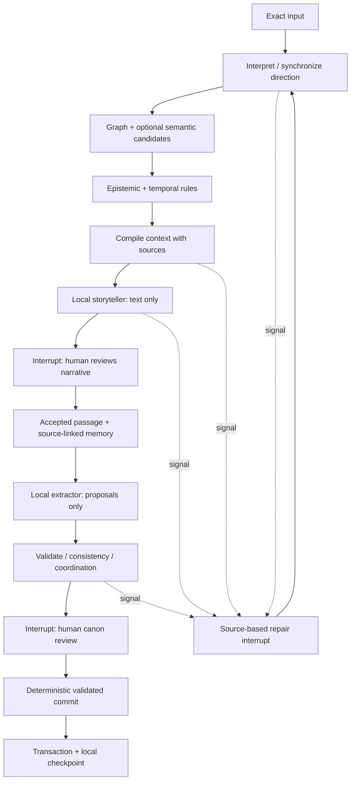

# ADR 0001: Extend the existing local world and story boundaries

Status: accepted for Storied 0.2.0. Date: 2026-09-05 (America/Denver).

## Decision and mapping

The inspected implementation and minimal delta are in [UPGRADE_PLAN.md](../UPGRADE_PLAN.md). Keep React/Zustand, the existing PGlite worker, JSONB project snapshots, document/relationship projections, pgvector, WebLLM, Transformers.js, and the existing scene/branch operations. No backend, graph database, remote checkpoint service, LangSmith, or Node runtime enters the application.

The workflow needs a small finite set of browser-safe transitions. A typed internal graph avoids adding another inference abstraction or optional remote runtime; using LangGraph branding provides no necessary capability here. `AdventureTurnGraph` declares node authority, directed edges, conditional routing, subgraph membership, and interrupt points. A node executes only through `stepWorkflow`; it receives an isolated frozen project snapshot. Model ports receive only text and a response schema, never a store, project object, or database handle. Their output is untrusted text, including when it looks like an operation or approval.

| Component            | Responsibility                                                            |
| -------------------- | ------------------------------------------------------------------------- |
| Vectors              | Semantic relevance; candidate identifiers only                            |
| World graph          | Entities, typed edges, facts, separate beliefs, explicit time, provenance |
| Execution graph      | Permitted next steps, interrupts, retries, versions, authority            |
| Coordination records | Human–AI direction and continuity support, as declared in ADR 0002        |
| Rules                | Schema, references, preconditions, branch/temporal access, invariants     |
| Local LLM            | Narrative and structured proposals; no canonical authority                |

## World graph

Entities remain stable nodes. Facts, claims, events, scenes, turns, proposals, approvals, and relationship records have typed graph views. `buildWorldGraph` supplies transactionally persisted `world_nodes`/`world_edges`; incoming/outgoing indexes support relational traversal. An explicit typed relationship records connection, ownership, or containment. Existing `owned by`, `inside`, and `located inside` labels have documented deterministic mappings; arbitrary labels are ordinary connections. Ownership points from item to owner; containment points from inner location to outer location. It is not inferred from embeddings.

Belief edges point to claims. A claim referring to a fact is an `about-not-asserting` edge, never an assertion that its text is true. The compiler never dereferences a belief into a secret correction. A private story-origin grant and a story-origin knowledge claim require matching adventure and turn ancestry. Explicitly promoted public canon is shared world state; unpromoted narrative, pending operations, memories, and direction remain branch-scoped. There is no automatic alternate-universe merge.

Events optionally carry an author-specified numeric `order`. Date text remains untouched, including approximate and unknown dates. Validity is half-open `[validFrom, validUntil)`, either explicit numbers or event anchors. No comparison is invented from titles, IDs, real calendar strings, or prose. Temporally restricted context is withheld when order is unknown. `learnedAtEventId` prevents discovery from appearing before its event. Undated author knowledge grants remain timeless; this is an explicit MVP convention.

Advisory graph checks cover participation after explicit death, overlapping exclusive ownership, reversed/empty intervals, containment cycles, and incompatible fact accounts. They report possible contradictions with source IDs. New conflicting proposals require a deliberate acknowledgement; no automatic repair of fictional state occurs. Natural-language event descriptions do not automatically establish death or causation. Review is bounded at 20,000 comparison/traversal steps, 200 findings, and 128 containment levels. Reaching a bound produces an explicit incomplete-review finding; it is not reported as a clean consistency result.

## Workflow and authority

Generation and extraction cannot apply canon. Only an explicit author action reaches the deterministic canon commit entry point. Its review ticket binds the exact proposal, world revision, direction version, and acknowledged findings. Validation runs again before applying the operation. The store clones the complete project and publishes it only after the operation succeeds; the database then commits project, graph, documents, and checkpoint projections together and awaits `syncToFs()` before reporting durability. Direct author editing remains an explicit, non-generative application authority; it advances the same material world revision.

Approvals preserve the exact reviewed operation, actor, source proposal and turn, result IDs, world/direction versions, and contradiction acknowledgements. Generated text remains distinct from the edited text accepted by the author. Rejected proposals remain narrative-only and retain an explicit rejection record.

## Checkpoints and repair

The existing local project contains workflow state and all important boundaries. `workflow_checkpoints` is a derived relational projection, saved in the same transaction. Meaningful node boundaries are flushed before model invocation and after its result. A browser interruption leaves an explicit resume control. Extraction failures retain the accepted passage and original extraction response; retry reruns extraction/validation rather than narrative generation. Probabilistic calls are never automatically replayed after a reload.

`worldRevision` advances when material story state changes, including motivation/notes, canon, scene time, branch head, and accepted prose. Checkpoint/progress writes do not invalidate themselves. Direction has an independent version. A changed world, branch, or direction stops stale results before acceptance/commit; synchronization invalidates derived context and retains original communication. Model output arriving after an edit is preserved as an obsolete result, not silently accepted. A changed active project stops the runner from writing into another project.

All nodes can emit a repair signal. Unresolved signals outrank ordinary forward edges, including a nominal END/checkpoint transition. The main graph reuses retrieval, coordination, canon validation/commit, and memory-maintenance groups; the architecture does not add speculative agents. Canon commit is a deterministic subgraph triggered by the approval interrupt. Entity creation and authoring suggestions retain their existing preview-only path; separate saved graph variants for them remain future work.

## Migration and limits

Project format 1 migrates additively to format 2, preserving IDs, prose, secrets, assets, and parent-linked histories. The IndexedDB/PGlite location is unchanged. Old exports remain importable; the old application cannot read format-2 exports. Workflows and provenance count toward the existing 32 MiB portable-project limit. Embeddings are derived and remain optional for restore.

Imported unfinished checkpoints require synchronization even if their revision number matches. Ordinary browser reloads preserve the saved workflow without treating unchanged state as an edit. Graph turn keys include adventure identity; repeated scene/event references are deduplicated in projections without changing the original project arrays.

Bounded source excerpts are still the summary implementation. Source IDs and stance-bearing knowledge remain separate; summaries cannot write facts or knowledge. Exact excerpts can still omit nuance and the small model can still invent it. No generic semantic truth checker, multi-agent theory, full calendar engine, or robust natural-language contradiction detector is claimed.
