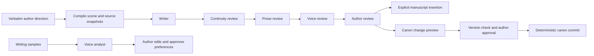

# ADR 0004: Manuscript specialists and author voice evidence

Status: accepted. Date: 2026-09-06. Scope: the approved manuscript and voice-profile release.

## Incremental change

The original Write page already owns books, chapters, scenes, Markdown text, and references. Existing provider adapters, local workers, PGlite persistence, temporal/epistemic graph filters, project exports, and shared writing preferences remain the foundation. `docs/MANUSCRIPT-PLAN.md` records the implementation sequence.

| Existing capability                         | Extension                                                                                    |
| ------------------------------------------- | -------------------------------------------------------------------------------------------- |
| Scene editor and `@` cards                  | Scene purpose/viewpoint/time/branch/profile, ordering, inline reference edits, review view   |
| `writingSystem` and `completeWithInference` | Distinct writer, continuity, prose, voice-review, and sample-analysis roles                  |
| Typed world graph                           | Voice evidence nodes; source snapshots, specialist steps, findings, revisions, and approvals |
| Temporal/epistemic filters                  | Scene-bound compilation with writer/reviewer visibility separation                           |
| Project mutation and backup                 | Format 3 studio records, old-format migration, explicit limits and reference validation      |
| Revision-bound Play approval                | Separate manuscript canon preview/ticket/commit with retained prior facts                    |

## Execution and authority

The graph is implemented by a typed node table and bounded runner, without a LangGraph dependency or hosted orchestration. Optional reviewers can be skipped. Review-only work begins at continuity. Sample analysis is a separate graph ending at author review. One selected inference resource is used serially; each specialist receives a fresh two-message context. Browser model chat state is explicitly reset between calls. Reviewer outputs are not fed into subsequent reviewers, avoiding agreement induced by an earlier opinion. This does not guarantee independent errors from the same underlying model.

The original scene, selection offsets, direction, source snapshots, omissions, private-context choice, selected layers, and source revision are retained. Each request is saved before invocation. Raw output is saved before validation. Invalid JSON, ungrounded quotes, ineligible evidence, cancellation, and changed sources prevent forward routing. No automatic retry or unbounded self-revision loop exists. Resume creates a new attempt at the failed node; completed nodes are not replayed. Re-grounding with current sources creates a child run. A reload offers recovery without invoking a model.

Findings refer to exact candidate spans and zero-based quote occurrences. Canon findings require eligible world evidence; voice findings require an approved trait; prose findings cannot cite fictional evidence. Code validates citation presence and span identity, not semantic entailment. Findings never carry executable mutations. Canon approval binds exact author edits, current world revision, scene ID, and full scene text. A correction deprecates the old fact; a temporal transition closes it at the chosen ordered event. Explicit approval and graph acknowledgment precede the application-owned mutation. Passage edits and insertions save the prior manuscript text.

## Distinct graphs

Voice evidence follows sample → exact excerpt → proposed trait → author-approved profile. The world projection stores typed nodes and edges for this lineage; it does not promote sample subject matter into facts or add samples to world retrieval. Only approved instructions enter manuscript context. Sample excerpts require a separate author choice. Findings link to immutable run-source nodes so a later change to canon cannot rewrite the evidence used by a past review.

The manuscript context respects an explicit scene time and branch head. Beliefs remain attributed statements; a claim's `factId` never retrieves a hidden correction. Private continuity context is opt-in; limited-viewpoint draft inputs remain filtered by character visibility even when the author opts into private review. Source budgets and excerpt omissions are exposed. This bounded compilation cannot certify complete continuity.

## MCW-inspired multi-agent extension

The canonical source pin, glossary, five repair operations, and limitations remain those recorded in [ADR 0002](0002-mcw-inspired-coordination.md): Framework 0.2, Constitution 1.1, revision `8365d220f2676f248c934e20f23e427e01cf3ce8`. The new orchestration is explicitly an **MCW-inspired multi-agent extension**. It is not canonical MCW, evidence that model agents share understanding, or a claim to implement the whole framework.

The extension addresses a practical boundary: a creative writer and independent reviewers must not silently substitute one another's interpretation for the author's communication or canonical records. Exact directions, requests, raw responses, and edited acceptance are separate records. State advancement forces synchronization; source recovery uses retained evidence; failed capabilities and omitted context remain visible. Author corrections create observable repair lineage. An unresolved failure cannot be skipped by ordinary forward routing. These are application mechanisms inspired by the framework, not measurements of human cognition.

This manuscript extension does not replicate every Play-specific ambiguity heuristic or provide a complete drift detector. Human review remains the point where an unsatisfactory interpretation can be rejected or redirected. Falsification conditions for the engineering mechanisms include a stale review approving canon, an unsupported citation reaching accepted findings, a private source reaching a disallowed writer context, a pending call replaying on reload, or a reviewer changing author text without approval. Tests exercise these observable boundaries. They do not validate MCW, prove semantic agreement, or establish a quality gain from multiple agents. No MCW score or authorship probability is produced.

## Limits and evolution

On-device requests use a compact response contract: one short draft paragraph or at most one finding/observation with bounded short fields. API review/analysis contracts allow up to three. Both paths use the same selected source evidence; compact output does not silently compress the author's direction or remove world facts.

Same-model specialists have correlated limitations. Output quality and semantic judgments need author review. The selected provider's output allowance can truncate a response; the failed attempt stays visible. The browser model has a 4,096-token context and a 550-token output cap. Reviewer/sample-analysis temperature is 0.1, generation temperature 0.8. API sampling follows the existing provider adapter. Request records are reproducibility evidence, not a promise of deterministic model output.

This release offers explicit review mode, TXT/Markdown/paste samples, short bounded tasks, inspectable evidence graphs, and no training or embeddings-derived prose score. It does not yet offer continuously remapped editor decorations, whole-book semantic review, DOCX/PDF sample extraction, per-specialist model routing, code plugins, or speech generation. Those can extend these boundaries after the core author workflow is exercised.
